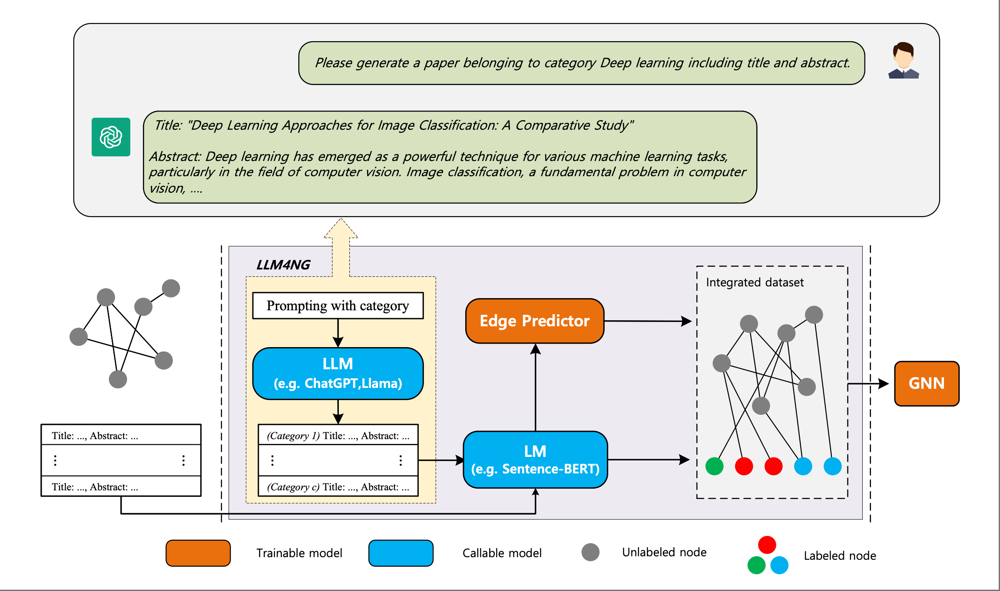
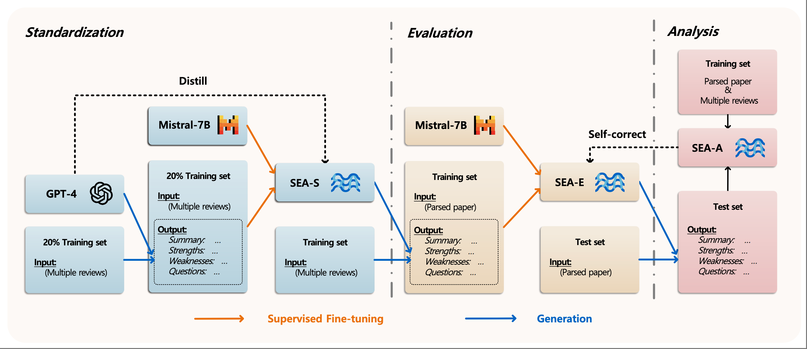
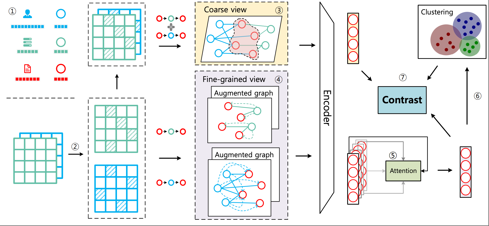

# 📝 Publications  

AAAI 2025

[Leveraging Large Language Models for Node Generation in Few-Shot Learning on Text-Attributed Graphs](https://arxiv.org/abs/2310.09872) &nbsp; 
 &nbsp;  \\
**Jianxiang Yu**, Yuxiang Ren, Chenghua Gong, Jiaqi Tan, Xiang Li, Xuecang Zhang.
- First to leverage LLMs for node generation in graph learning. 🔍
- Plug-and-play, lightweight framework with minimal overhead with minimal overhead. 🚀

<!-- - `AAAI 2025` [Leveraging Large Language Models for Node Generation in Few-Shot Learning on Text-Attributed Graphs](https://arxiv.org/abs/2310.09872), &nbsp;    **Jianxiang Yu**, Yuxiang Ren, Chenghua Gong, Jiaqi Tan, Xiang Li, Xuecang Zhang. -->

EMNLP 2024

[Automated Peer Reviewing in Paper SEA: Standardization, Evaluation, and Analysis](https://arxiv.org/abs/2407.12857) &nbsp;  &nbsp;  \\
**Jianxiang Yu\***, Zichen Ding\*, Jiaqi Tan, Kangyang Luo, Zhenmin Weng, Chenghua Gong, Long Zeng, Renjing Cui, Chengcheng Han, Qiushi Sun, Zhiyong Wu, Yunshi Lan, Xiang Li. 
- Check demos at [**Our Website**](https://ecnu-sea.github.io/). 🌐
- The model is available at [**hugging face**](https://huggingface.co/ECNU-SEA/SEA-E). 🤗
- An innovative framework for automating peer review. 🌊

TKDE 2024

[Heterogeneous Graph Contrastive Learning with Meta-path Contexts and Adaptively Weighted Negative Samples](https://ieeexplore.ieee.org/abstract/document/10487103) &nbsp; 
 &nbsp;  \\
**Jianxiang Yu**, Qingqing Ge, Xiang Li, Aoying Zhou.
- Coarse and fine-grained views for HIN contrastive learning. 🐾
- Gradient-based InfoNCE analysis & weighted contrastive loss design. 🎯

<!-- - `TKDE 2024` [Heterogeneous Graph Contrastive Learning with Meta-path Contexts and Adaptively Weighted Negative Samples](https://ieeexplore.ieee.org/abstract/document/10487103), &nbsp;    **Jianxiang Yu**, Qingqing Ge, Xiang Li, Aoying Zhou. -->

<!-- - `EMNLP 2024` [Automated Peer Reviewing in Paper SEA: Standardization, Evaluation, and Analysis](https://arxiv.org/abs/2407.12857), &nbsp;    **Jianxiang Yu\***, Zichen Ding\*, Jiaqi Tan, Kangyang Luo, Zhenmin Weng, Chenghua Gong, Long Zeng, Renjing Cui, Chengcheng Han, Qiushi Sun, Zhiyong Wu, Yunshi Lan, Xiang Li. -->

- `FCS 2025` [A Survey on Learning from Graphs with Heterophily:
Recent Advances and Future Directions](https://arxiv.org/abs/2401.09769),   Chenghua Gong, Yao Cheng, **Jianxiang Yu**, Can Xu, Caihua Shan, Siqiang Luo, Xiang Li

- `WWW 2025` [Hierarchical Vector Quantized Graph Autoencoder with Annealing-Based Code Selection](https://dl.acm.org/doi/abs/10.1145/3696410.3714656),   Long Zeng, **Jianxiang Yu**, Jiapeng Zhu, Qingsong Zhong, Xiang Li

- `KDD 2025` [Variational Graph Autoencoder for Heterogeneous Information Networks with Missing and Inaccurate Attributes](https://arxiv.org/abs/2311.07929),   Yige Zhao, **Jianxiang Yu**, Yao Cheng, Chengcheng Yu, Yiding Liu, Xiang Li, Shuaiqiang Wang.

- `KDD 2025` [RELIEF: Reinforcement Learning Empowered Graph Feature Prompt Tuning](https://arxiv.org/abs/2408.03195),   Jiapeng Zhu, Zichen Ding, **Jianxiang Yu**, Jiaqi Tan, Xiang Li.

- `ECML PKDD 2024` [Self-Pro: Self-Prompt and Tuning Framework for Graph Neural Networks](https://arxiv.org/abs/2310.10362v2),   ChengHua Gong, Xiang Li, **Jianxiang Yu**, Yao Cheng, Jiaqi Tan, Chengcheng Yu.

<!-- - `TKDE 2024` [Heterogeneous Graph Contrastive Learning with Meta-path Contexts and Adaptively Weighted Negative Samples](https://ieeexplore.ieee.org/abstract/document/10487103), &nbsp;    **Jianxiang Yu**, Qingqing Ge, Xiang Li, Aoying Zhou. -->

- `SDM 2023` [Heterogeneous Graph Contrastive Learning with Meta-path Contexts and Weighted Negative Samples](https://epubs.siam.org/doi/abs/10.1137/1.9781611977653.ch5), &nbsp;    **Jianxiang Yu**, Xiang Li.

- `ICKG 2023` [Context-Aware Session-Based Recommendation with Graph Neural Networks](https://ieeexplore.ieee.org/abstract/document/10412788),   Zhihui Zhang, **Jianxiang Yu**, Xiang Li.

More preprints under review will be released soon, and some papers can be found on Google Scholar. 📚✨🔍

<!-- 

EMNLP 2024

[Automated Peer Reviewing in Paper SEA: Standardization, Evaluation, and Analysis](https://arxiv.org/abs/2407.12857) [CCF-B]   \\
Jianxiang Yu\*, **Zichen Ding\***, Jiaqi Tan, Kangyang Luo, Zhenmin Weng, Chenghua Gong, Long Zeng, Renjing Cui, Chengcheng Han, Qiushi Sun, Zhiyong Wu, Yunshi Lan, Xiang Li. 
- Check demos at [**Our Website**](https://ecnu-sea.github.io/). 🌐
- An innovative framework for automating peer review. 🌊

 -->
